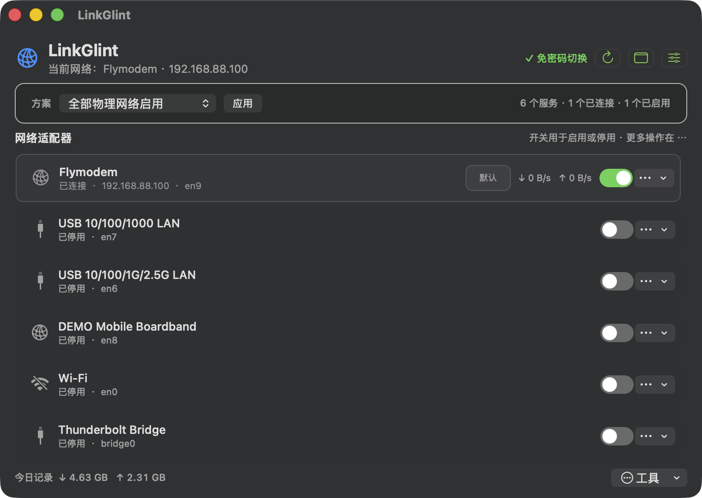

<p align="center">
  
</p>

<h1 align="center">LinkGlint</h1>

<p align="center"><strong>在 macOS 菜单栏看清连接、流量与网络优先级。</strong></p>

<p align="center">
  <a href="https://github.com/HarenaGodz/LinkGlint/releases/latest"></a>
  
  
  
  <a href="LICENSE"></a>
</p>

<p align="center">
  LinkGlint 是一款轻量、原生的 macOS 菜单栏网络管理工具。<br>
  它将 Wi‑Fi、有线网络、VPN 和其他网络服务集中到一个紧凑面板中。
</p>

<table>
  <tr>
    <td width="58%"></td>
    <td width="42%"></td>
  </tr>
  <tr>
    <td align="center"><sub>完整网络管理窗口</sub></td>
    <td align="center"><sub>菜单栏快捷面板与实时流量曲线</sub></td>
  </tr>
</table>

## 为什么使用 LinkGlint

- **状态一眼可见**：菜单栏显示网络名称和实时上下行速度，支持单行、双行、Byte/s 与 bit/s。
- **流量趋势清晰**：快捷面板绘制最近 60 次采样的下载、上传曲线，低流量和突发峰值均可辨认。
- **常用操作集中**：直接启停或切换服务，连接 Wi‑Fi、修改 DNS、重命名服务和调整优先级。
- **复杂配置可复用**：保存网络方案，快速切换仅 Wi‑Fi、仅有线或自定义服务组合。
- **操作反馈可靠**：停用当前连接前确认，修改过程即时反馈，失败时恢复界面状态。
- **原生且克制**：使用 AppKit 与 macOS 原生登录项；关闭主窗口后继续安静驻留菜单栏。

## 下载与安装

1. 从 [GitHub Releases](https://github.com/HarenaGodz/LinkGlint/releases/latest) 下载最新的 macOS 通用版本。
2. 解压后将 `LinkGlint.app` 移入“应用程序”文件夹。
3. 启动 LinkGlint；如 macOS 首次阻止打开，请在访达中右击应用并选择“打开”。

| 项目 | 要求 |
| --- | --- |
| 系统 | macOS 13 Ventura 或更高版本 |
| 处理器 | Apple Silicon 或 Intel |
| 运行方式 | 菜单栏应用；主窗口关闭后仍可运行 |
| 许可证 | MIT |

## 快速使用

| 操作 | 结果 |
| --- | --- |
| 单击状态栏图标 | 打开快捷面板，查看服务状态与实时流量曲线 |
| 右击状态栏图标 | 打开完整功能菜单、用量、诊断和偏好设置 |
| 点击服务开关 | 启用或停用对应的 macOS 网络服务 |
| 点击“切换” | 切换到目标 Wi‑Fi 或有线服务 |
| 点击“加入 Wi-Fi…” | 打开次级面板，浏览附近网络并选择连接 |
| 打开“调整服务优先级” | 拖动服务并应用新的系统优先顺序 |
| 打开“偏好设置” | 调整显示内容、网速单位、布局、标记样式和刷新间隔 |

菜单栏网速标记提供三种样式：**蓝橙圆点**、**彩色方向三角**和**经典上下箭头**。
状态栏名称、标记位置及数字区域经过固定布局处理，速率变化时不会带动项目左右晃动。

## 功能概览

### 监控与诊断

- 当前网络名称、连接状态、IP 地址、默认路由和 DNS
- 实时下载/上传速度及最近 60 次采样曲线
- 当日与本次运行的本地流量记录
- 网关延迟、DNS 查询及诊断报告导出

### 网络管理

- 启用、停用和切换 macOS 网络服务
- 拖拽调整服务优先级或一键置顶
- 扫描并选择附近 Wi‑Fi，显示信号与加密状态，同时保留手动网络输入
- 保存、应用和删除网络配置方案
- Wi‑Fi / 有线网络快捷切换

### 菜单栏定制

- 显示或隐藏网络名称、实时网速
- 单行或双行紧凑布局
- Byte/s 或 bit/s 单位
- 1、2、5 秒刷新间隔
- 三种上下行标记样式
- 登录时自动启动

## 权限与本地数据

读取网络状态和实时流量不需要管理员权限。首次修改系统网络配置时，LinkGlint 会请求一次
管理员授权并安装受限助手；助手由 `root` 持有，只接受项目中定义的固定网络操作，不接收
任意 Shell 命令或可执行文件路径。

首次浏览附近 Wi-Fi 时，macOS 会请求定位服务权限，这是系统用于保护附近无线网络名称的隐私
要求；LinkGlint 只将该权限用于本机 Wi-Fi 扫描，不会保存或上传位置。即使不授予权限，也可在
次级面板中选择“其他网络…”并手动输入 SSID。

偏好设置、网络方案和流量用量记录保存在当前用户的本地 `UserDefaults` 中。项目没有集成账号
系统或遥测 SDK。面板中的“今日记录”是 **LinkGlint 运行期间的本地累计值**，并非 macOS
全系统历史流量账单；实时曲线保留最近 60 次采样，实际覆盖时长随刷新间隔变化。

更多实现说明见 [`docs/ARCHITECTURE.md`](docs/ARCHITECTURE.md)。

## 从源码构建

需要 macOS 13+、Xcode Command Line Tools 和 Swift 5.10 工具链。

```bash
git clone https://github.com/HarenaGodz/LinkGlint.git
cd LinkGlint
./build_app.sh
open dist/LinkGlint.app
```

`build_app.sh` 默认生成同时包含 `arm64` 与 `x86_64` 的通用 App。仅构建当前机器架构可使用：

```bash
ARCHS="$(uname -m)" ./build_app.sh
```

运行单元测试、Release 构建与签名检查：

```bash
./scripts/verify.sh
```

项目结构：

```text
Sources/LinkGlint/         菜单栏应用、界面与网络管理逻辑
Sources/LinkGlintHelper/   受限的本机权限助手
Tests/LinkGlintTests/      解析、偏好、流量与方案测试
Resources/                 Info.plist 与应用图标
docs/                      架构说明与界面图片
build_app.sh               通用 App 打包与签名脚本
scripts/verify.sh          测试、构建及签名验证
```

## 常见问题

<details>
<summary><strong>关闭窗口后 LinkGlint 去哪里了？</strong></summary>

主窗口关闭后 Dock 图标会隐藏，但 LinkGlint 继续在菜单栏运行。再次单击状态栏图标即可操作；
如状态项被隐藏，请展开菜单栏隐藏区域，并按住 <kbd>⌘</kbd> 将它拖到常驻位置。
</details>

<details>
<summary><strong>怎样完全退出？</strong></summary>

右击状态栏图标，在菜单底部选择“退出 LinkGlint”。
</details>

<details>
<summary><strong>为什么修改网络时需要管理员权限？</strong></summary>

macOS 要求以管理员权限修改网络服务、DNS 和优先级。LinkGlint 只在首次安装或更新受限助手时
请求授权，之后由助手执行固定范围内的网络操作。
</details>

## 参与项目

欢迎提交 [Issue](https://github.com/HarenaGodz/LinkGlint/issues) 或 Pull Request。提交代码前请运行：

```bash
swift test
swift build -Xswiftc -warnings-as-errors
```

版本变化见 [`CHANGELOG.md`](CHANGELOG.md)。组织镜像位于
[`yo1Code/LinkGlint`](https://github.com/yo1Code/LinkGlint)。

## 许可证

[MIT License](LICENSE) · 由 **HarenaGodz（Harena）** 开发维护。
