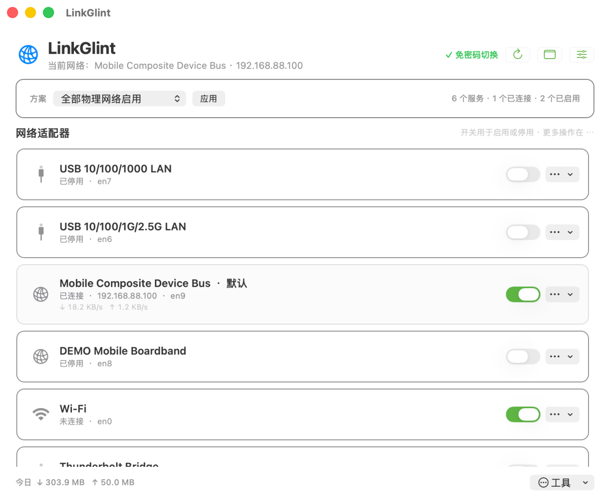

<p align="center">
  
</p>

<h1 align="center">LinkGlint</h1>

<p align="center"><strong>轻量、原生的 macOS 菜单栏网络管理工具。</strong></p>

<p align="center">
  
  
  <a href="LICENSE"></a>
</p>

LinkGlint 将 Wi‑Fi、有线网络、VPN 和其他网络服务集中到菜单栏，方便查看状态、
切换网络与处理常用配置。



## 下载

从 [GitHub Releases](https://github.com/HarenaGodz/LinkGlint/releases) 下载适用于
Apple Silicon 与 Intel Mac 的通用版本。需要 macOS 13 或更高版本。

## 主要功能

- 菜单栏实时显示网络名称及上下行网速，支持单双行、Byte/s 与 bit/s
- 单击打开快捷面板，直接启停、切换和管理网络服务
- 拖拽调整 macOS 网络服务优先级，也支持一键置顶
- 设置 DNS、连接其他 Wi‑Fi、重命名服务和保存网络方案
- 查看 IP、路由、DNS、流量用量并运行网络诊断
- 原生“登录时启动”，关闭主窗口后继续在菜单栏运行

## 使用

- **单击状态栏图标**：打开快捷面板
- **右击状态栏图标**：打开完整功能菜单
- **调整优先级**：在快捷面板、完整菜单或主窗口“工具”中选择“调整服务优先级”，
  拖动服务后应用顺序
- **自定义网速显示**：打开“偏好设置”，选择显示内容、单位、单双行与刷新间隔

首次修改系统网络配置时，应用会请求一次管理员授权并安装受限助手。助手只接受固定的
网络操作；之后启停服务、修改 DNS、调整优先级和切换网络不再重复询问密码。

## 构建与验证

需要 Xcode Command Line Tools：

```bash
./build_app.sh
open dist/LinkGlint.app
```

运行单元测试、Release 构建与签名检查：

```bash
./scripts/verify.sh
```

架构与实现细节见 [`docs/ARCHITECTURE.md`](docs/ARCHITECTURE.md)，版本记录见
[`CHANGELOG.md`](CHANGELOG.md)。

## 许可证

[MIT License](LICENSE) · 由 **HarenaGodz（Harena）** 开发维护。
